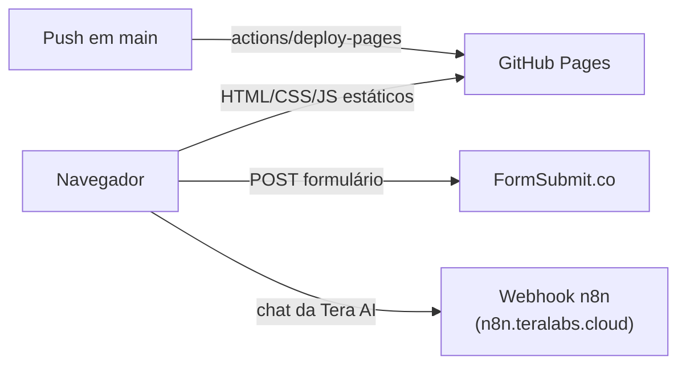

<div align="center">

# Tera

**Site institucional da Tera Innovation and Technology** — desenvolvimento de software sob medida, produto e IA aplicada, em Maringá-PR.

[teralabs.cloud](https://teralabs.cloud) · [Documentação](docs/README.md) · [Reportar problema](https://github.com/canhetejr/tera-site/issues)

</div>

---

## Sobre

Este repositório contém o site público da Tera: páginas institucionais (início, serviços, projetos, sobre), um formulário de briefing com refinamento por IA e uma página de showcase com um renderizador WebGL autoral.

É um site **estático**, sem framework, sem bundler e sem etapa de build — HTML, CSS e JavaScript são servidos diretamente como estão no repositório.

## Principais recursos

- **Páginas institucionais** (`index.html`, `servicos.html`, `projetos.html`, `sobre.html`) com SEO, Open Graph e dados estruturados (`schema.org`) embutidos.
- **Briefing guiado** (`briefing.html`): wizard de 4 perguntas que envia o briefing por e-mail via [FormSubmit](https://formsubmit.co/) e oferece refinamento opcional por um agente de IA (Tera AI), com download do resultado em PDF.
- **Menu responsivo** compartilhado entre todas as páginas por um único script (`assets/js/menu.js`), sem duplicar markup.
- **Experiência 3D** (`experiencia/index.html`): cena WebGL2 escrita à mão (sem engine/CDN) que reage ao scroll, usada como showcase técnico.
- **SEO técnico**: `robots.txt`, `sitemap.xml`, canonical tags, `og:` e `twitter:` meta tags, dados `Organization`/`ProfessionalService`/`FAQPage` em JSON-LD.

## Stack

| Camada | Tecnologia |
|---|---|
| Marcação | HTML5 estático (um arquivo por página) |
| Estilos | CSS puro (`assets/css/*.css`), sem pré-processador |
| Interatividade | JavaScript (ES Modules), sem framework |
| Gráficos 3D | WebGL2 nativo (renderer autoral em `assets/js/core/`) |
| Fontes | Inter (self-hosted, `.woff2`) |
| Envio de formulário | [FormSubmit](https://formsubmit.co/) |
| Chat com IA | Webhook [n8n](https://n8n.io/) (`n8n.teralabs.cloud`) |
| Hospedagem | GitHub Pages |
| Deploy | GitHub Actions (`.github/workflows/static.yml`) |

Não há `package.json`, gerenciador de pacotes, bundler ou framework de testes neste repositório — o projeto não depende de etapa de build.

## Arquitetura



O site não tem backend próprio. Duas páginas se comunicam com serviços externos diretamente do navegador:

- `briefing.html` envia o formulário para o FormSubmit (que retransmite por e-mail) e, opcionalmente, conversa com um agente de IA através de um webhook de chat hospedado em n8n.
- Todo o restante é HTML/CSS/JS servido como arquivo estático, sem chamadas de rede além de fontes e imagens locais.

Veja [`docs/architecture.md`](docs/architecture.md) para o detalhamento do renderer WebGL de `/experiencia` e do fluxo do briefing.

## Começando

### Pré-requisitos

- Um navegador atual (o site usa ES Modules e WebGL2 em `/experiencia`).
- Qualquer servidor HTTP estático para desenvolvimento local — não é possível abrir os arquivos com `file://` porque os módulos JS (`type="module"`) exigem HTTP.

### Executando localmente

Não há script de build. Sirva a raiz do repositório com qualquer servidor estático, por exemplo:

```bash
git clone https://github.com/canhetejr/tera-site.git
cd tera-site
python3 -m http.server 8000
```

Depois acesse `http://localhost:8000`.

Alternativas equivalentes: `npx serve`, a extensão Live Server do VS Code, ou qualquer servidor estático de sua preferência.

### Variáveis de ambiente

Não há arquivo `.env` ou variáveis de ambiente neste projeto. Os únicos endpoints externos (FormSubmit e o webhook n8n) estão referenciados diretamente no código-fonte de `briefing.html`, por serem endpoints públicos de recebimento de formulário/chat, não segredos.

## Estrutura do projeto

```
.
├── index.html              # Home — hero, serviços, projetos, sobre e FAQ em uma SPA de rolagem/hash
├── servicos.html           # Página dedicada de serviços
├── projetos.html           # Página dedicada de projetos
├── sobre.html               # Página dedicada de "sobre"
├── briefing.html            # Wizard de briefing + chat com a Tera AI
├── contato.html             # Redirecionamento (301 via meta refresh) para briefing.html
├── experiencia/
│   └── index.html           # Showcase com cena WebGL2 autoral
├── assets/
│   ├── css/                 # tera-site.css, tera.css, menu.css
│   ├── js/
│   │   ├── core/             # Renderer WebGL (gl.js, renderer.js, layouts.js, grammar.js, quality.js)
│   │   ├── motion/            # Câmera, timeline, easings e cenas da experiência 3D
│   │   ├── experience.js      # Orquestra a experiência de /experiencia
│   │   ├── menu.js            # Menu responsivo compartilhado por todas as páginas
│   │   └── ui.js               # Comportamento de interface (magnetismo, cursor, etc.)
│   ├── fonts/                 # Inter, self-hosted (.woff2)
│   └── images/                 # Logos, símbolo e imagens de Open Graph
├── robots.txt
├── sitemap.xml
└── .github/workflows/static.yml  # Deploy automático para GitHub Pages
```

## Uso

O site não expõe uma API nem um CLI. O "uso" é a navegação normal entre as páginas; o único fluxo interativo relevante é o briefing:

1. O visitante responde a 4 perguntas em `briefing.html` (nome, empresa, ideia, forma de contato preferida).
2. Ao enviar, o formulário é submetido ao FormSubmit, que encaminha por e-mail para a equipe da Tera (e, opcionalmente, envia cópia para o próprio lead).
3. Antes de enviar, o visitante pode abrir "Melhorar com a Tera AI", um chat que conversa com um agente hospedado em n8n para refinar a descrição do projeto.
4. O briefing final pode ser baixado em PDF pelo próprio visitante.

## Deploy

O deploy é automático via GitHub Actions (`.github/workflows/static.yml`): todo push em `main` publica a raiz do repositório inteira no GitHub Pages, usando `actions/upload-pages-artifact` e `actions/deploy-pages`. Não há etapa de build — o conteúdo do repositório é publicado como está.

## Documentação

Documentação adicional vive em [`docs/`](docs/README.md):

- [Arquitetura](docs/architecture.md) — o renderer WebGL de `/experiencia` e o fluxo do briefing com IA.

## Contribuindo

Veja [CONTRIBUTING.md](CONTRIBUTING.md).

## Changelog

O histórico de mudanças notáveis fica em [CHANGELOG.md](CHANGELOG.md).
