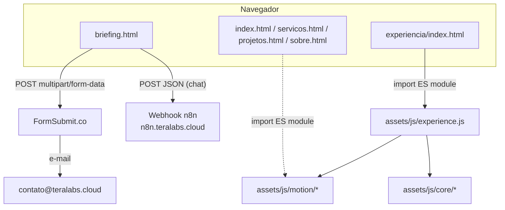

# Arquitetura

Este documento descreve as duas partes não triviais do site: a comunicação de `briefing.html` com serviços externos, e a cena WebGL2 autoral usada em `/experiencia` (e, em versão reduzida, como pano de fundo animado no hero da home).

## Visão geral

O site é 100% estático — não há servidor de aplicação, banco de dados ou API própria. Cada página HTML é autocontida (CSS e JSON-LD inline, JS carregado por `<script>`), com exceção dos módulos ES compartilhados em `assets/js/`.

## Fluxo do briefing (`briefing.html`)

`briefing.html` é um wizard client-side de 4 passos (nome/empresa, ideia, forma de contato, revisão) implementado em JavaScript inline no próprio arquivo — sem framework.

1. **Envio do briefing** — o formulário (`#briefing-form`) é submetido via `fetch` para `https://formsubmit.co/ajax/contato@teralabs.cloud`. O FormSubmit é um serviço de terceiros que recebe o `POST` e encaminha o conteúdo por e-mail; o site não guarda nem processa os dados em nenhum backend próprio. Um campo honeypot (`_honey`) é usado como proteção anti-spam básica.
2. **Cópia para o lead** — quando o visitante pede, o campo oculto `_cc` é preenchido antes do envio para que o FormSubmit também mande uma cópia ao próprio remetente.
3. **Refinamento com IA (opcional)** — o botão "Melhorar com a Tera AI" abre um chat que envia mensagens via `fetch` para um webhook de chat hospedado em n8n:
   `https://n8n.teralabs.cloud/webhook/78fe5425-92f2-4546-b1f6-f349b47c0ca7/chat`.
   Esse endpoint é o único ponto de integração com IA do site; a lógica do agente (prompt, modelo, orquestração) vive no workflow do n8n, fora deste repositório.
4. **Download em PDF** — a revisão final do briefing pode ser exportada em PDF pelo próprio navegador (impressão da seção `#print-briefing` com CSS de `@media print`), sem serviço externo.

> O URL do webhook do n8n é público por natureza (é o endpoint que o navegador do visitante chama diretamente) e não deve ser tratado como segredo — mas qualquer credencial de acesso ao workflow do n8n em si não está, e não deve estar, neste repositório.

## Menu responsivo (`assets/js/menu.js`)

Um único script monta o painel de navegação mobile a partir do `<nav>` que já existe em cada página, em vez de duplicar o markup do menu nos seis arquivos HTML. Isso significa que a home (que usa rotas por hash, `#servicos`, `#projetos`...) e as páginas internas (que usam URLs de arquivo, `servicos.html`...) compartilham o mesmo comportamento sem o script precisar saber a diferença.

## A experiência WebGL (`/experiencia` e o hero da home)

`experiencia/index.html` é uma página de showcase técnico: uma cena 3D renderizada em WebGL2 puro, sem engine (Three.js, Babylon etc.) e sem CDN — um argumento deliberado do próprio site ("a Tera constrói sistemas; seria estranho importar um").

### Módulos

| Caminho | Responsabilidade |
|---|---|
| `assets/js/experience.js` | Orquestrador: liga scroll → timeline → câmera → renderer → estado do DOM. |
| `assets/js/core/gl.js` | Helpers WebGL2 de baixo nível (contexto, programas, VAOs, quad compartilhado). |
| `assets/js/core/renderer.js` | O renderer (`TeraCore`): três programas instanciados — nós, conexões, superfícies — cada um com uma única draw call. |
| `assets/js/core/grammar.js` | A "gramática" visual: regras de como conexões se curvam (um único raio de curva, sempre resolvendo para baixo-à-direita, terminando em um ponto), derivada da própria marca da Tera. |
| `assets/js/core/layouts.js` | As oito disposições ("layouts") que a mesma população de partículas assume ao longo da cena — a ideia central é que os nós nunca são substituídos, apenas reorganizados. |
| `assets/js/core/quality.js` | Detecção de tier de dispositivo (`high`/`medium`/`low`) e um "governor" que ajusta contagem de nós, DPR e distância de câmera ao hardware disponível. |
| `assets/js/motion/timeline.js` | Timeline de scroll nativo (sem scroll-jacking): cada cena é uma seção alta com um estágio `sticky` dentro dela. |
| `assets/js/motion/camera.js` | Câmera que lê a timeline e produz as matrizes view/projection; o ponteiro do mouse adiciona apenas um leve deslocamento. |
| `assets/js/motion/scenes.js` | O roteiro: uma lista linear de "movimentos" da cena — a única fonte de verdade para câmera, paleta e estrutura WebGL. |
| `assets/js/motion/easings.js`, `durations.js`, `math.js`, `transitions.js` | Vocabulário compartilhado de curvas de animação, durações nomeadas, matemática usada tanto pela camada DOM quanto pela WebGL, e o binding de elementos de DOM à timeline. |

### Princípios de design (evidenciados nos comentários do código-fonte)

- **WebGL é progressive enhancement.** Se o contexto WebGL2 não inicializa, a página abaixo continua completa e legível (`assets/js/experience.js`).
- **Uma única fonte de verdade para o tempo.** A timeline de scroll dirige câmera, paleta, estrutura 3D e estado do DOM — não há um segundo sistema de animação rodando em paralelo.
- **Adaptação por tier, não degradação binária.** `core/quality.js` não apenas liga/desliga efeitos em mobile: reduz contagem de partículas, DPR e distância de câmera mantendo a mesma narrativa visual.

## Deploy

Não há passo de build. O workflow `.github/workflows/static.yml` publica a raiz inteira do repositório no GitHub Pages a cada push em `main`, via `actions/upload-pages-artifact` + `actions/deploy-pages`.
