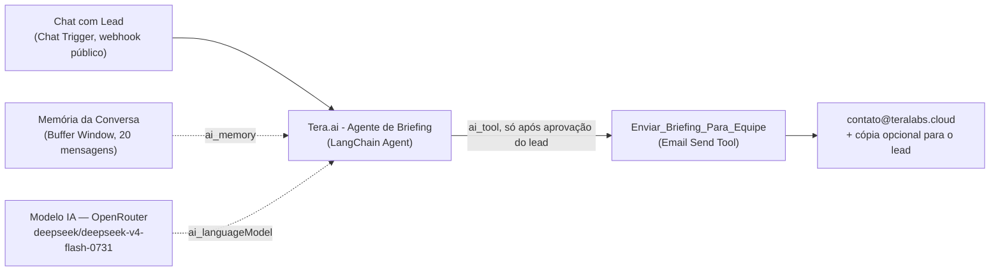

# Workflow n8n — Tera AI

O chat de refinamento em `briefing.html` ("Melhorar com a Tera AI") não roda nenhum código deste repositório: ele conversa diretamente com um workflow hospedado em uma instância n8n própria da Tera. Este documento descreve esse workflow para quem for depurar ou evoluir o chat — a fonte de verdade continua sendo o n8n, não este arquivo.

- **Workflow:** `Tera.ai - Briefing de Leads` (id `UxznmNucH9yro5AR`, instância n8n da Tera)
- **Webhook:** `https://n8n.teralabs.cloud/webhook/78fe5425-92f2-4546-b1f6-f349b47c0ca7/chat` — mesmo endpoint referenciado em `briefing.html` como `AI_WEBHOOK`.

## O que ele faz

Recebe a primeira mensagem já com o briefing preenchido no wizard (nome, empresa, ideia, forma de contato), conversa com o lead para completar o que falta ou está vago, e — só depois que o lead aprova um resumo — envia o briefing final por e-mail para a equipe da Tera, com cópia opcional para o próprio lead.

## Nós do workflow

| Nó | Tipo | Função |
|---|---|---|
| `Chat com Lead` | `@n8n/n8n-nodes-langchain.chatTrigger` | Trigger público (`mode: webhook`), qualquer origem permitida (`allowedOrigins: *`), resposta síncrona (`responseMode: lastNode`). É o endpoint que `briefing.html` chama. |
| `Tera.ai - Agente de Briefing` | `@n8n/n8n-nodes-langchain.agent` | O agente conversacional (LangChain Agent, `promptType: auto`). Recebe o system prompt com as regras de comportamento (ver abaixo). |
| `Memoria da Conversa` | `@n8n/n8n-nodes-langchain.memoryBufferWindow` | Mantém as últimas 20 mensagens da conversa como contexto — sem persistência entre sessões diferentes. |
| `Modelo IA (OpenRouter)` | `@n8n/n8n-nodes-langchain.lmChatOpenRouter` | Modelo `deepseek/deepseek-v4-flash-0731` via OpenRouter, `temperature: 0.6`, `maxTokens: 350` — respostas curtas por design. |
| `Enviar_Briefing_Para_Equipe` | `n8n-nodes-base.emailSendTool` | Ferramenta que o agente decide chamar. Envia de `notificacoes@teralabs.cloud` para `contato@teralabs.cloud`, com assunto e corpo gerados pelo próprio agente (`$fromAI`). 3 tentativas automáticas com 2s de intervalo em caso de falha. |

## Comportamento do agente (resumo do system prompt)

O prompt completo vive só no n8n; aqui vai um resumo das regras que ele impõe, para quem for depurar respostas inesperadas do chat:

- **Não recomeça a coleta.** A primeira mensagem já chega com nome, empresa, ideia e forma de contato preenchidos pelo wizard; o agente só pergunta o que falta (objetivo, público-alvo, prazo, orçamento, referências).
- **Nunca envia sem aprovação explícita.** A ferramenta `Enviar_Briefing_Para_Equipe` só pode ser chamada depois que o agente mostrar um resumo em lista e o lead aprovar com uma resposta clara ("sim", "pode enviar"). Receber o briefing inicial não conta como aprovação.
- **Respostas curtas.** No máximo 2–4 frases por mensagem, uma pergunta de cada vez, tom consultivo e caloroso — nunca um interrogatório.
- **Escopo travado.** A única função do agente é refinar o briefing; ele se recusa a discutir outros assuntos ou mudar de papel, mesmo sob pedidos de jailbreak.
- **Encaminha para humano sob pedido.** Se o lead pedir para falar com uma pessoa, o agente indica `contato@teralabs.cloud` em vez de insistir no chat.
- **Nunca inventa confirmação de envio.** Se a ferramenta de e-mail falhar, o agente avisa honestamente e orienta o lead a escrever direto para `contato@teralabs.cloud`.
- **Cópia condicional para o lead.** O e-mail é enviado com cópia (`cc`) para o próprio lead apenas quando ele informou um endereço de e-mail válido na conversa; se o contato preferido for WhatsApp/telefone, a cópia fica vazia.

## O que não está — e não deve estar — neste repositório

- O texto integral do system prompt do agente (fica só no n8n).
- A credencial da OpenRouter usada pelo nó `Modelo IA (OpenRouter)`.
- Qualquer configuração de envio de e-mail (SMTP/API do provedor por trás do `Enviar_Briefing_Para_Equipe`).

O único artefato compartilhado entre este repositório e o workflow é o **URL do webhook** — público por natureza, pois é o endpoint que o navegador do visitante chama diretamente (`assets` do site não expõem nenhuma credencial do n8n).

## Como alterar o comportamento do chat

Mudanças de tom, regras de aprovação ou formato do e-mail são feitas **no workflow do n8n**, não neste repositório. Do lado do site, `briefing.html` só precisa continuar apontando para o mesmo `AI_WEBHOOK` — trocar de workflow ou de webhook exige atualizar essa constante em `briefing.html` (veja [`docs/architecture.md`](architecture.md#fluxo-do-briefing-briefinghtml)).
